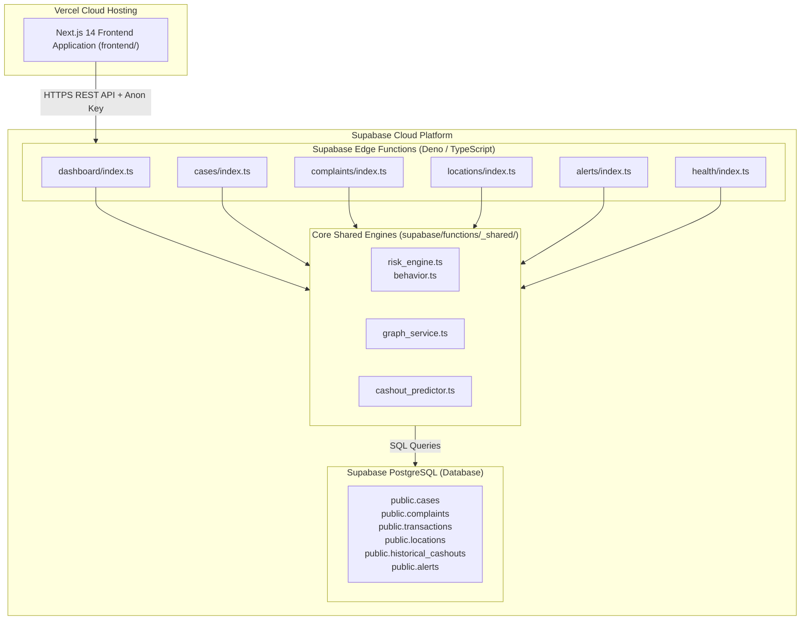

# 🛡️ UPIShield: Proactive Cybercrime Intelligence & ATM/CSP Cash-Out Prediction Framework

> **SIH 2026 Problem Statement SIH26184 — Cloud-Native Vercel + Supabase Architecture**  
> *Note: UPIShield is a cybercrime intelligence and fraud-analysis prototype powered by 100% synthetic/simulated transaction and cybercrime data. It does **NOT** connect to live banking networks, NPCI/UPI production gateways, real NCRP databases, or live personal financial records.*

---

## 🌍 Overview

Unified Payments Interface (UPI) transaction volume in India has grown exponentially, enabling seamless real-time digital payments. However, this speed is also exploited by organized cybercrime syndicates. When victims fall prey to phishing, investment scams, or digital arrest frauds, illicit funds are routed instantaneously across multi-hop "mule account" networks within minutes. 

The primary operational challenge for law enforcement agencies (LEAs) and financial nodal officers is **rapid funds dissipation**. Money moves through multiple layers (Layer-1 Hubs &rarr; Layer-2 Distribution accounts) and is withdrawn as physical cash at ATMs or Customer Service Points (CSPs / Micro-ATMs) before a 1930 NCRP complaint can be formally processed and freeze orders issued.

**UPIShield (SIH26184 Edition)** addresses this challenge by introducing an end-to-end cybercrime intelligence and predictive surveillance pipeline deployable serverlessly on **Vercel + Supabase**:
- **NCRP Complaint Ingestion & Case Convergence**: Aggregates multi-source incident reports to identify shared mule targets and converge fragmented complaints into unified investigative cases.
- **Custom Dual-Layer Fraud Risk Engine**: Combines transparent general risk rules (for zero-history cold start transactions) with statistical behavioral anomaly detection (for established accounts).
- **Multi-Hop Mule Graph Service**: Reconstructs 4-tier syndicate money trails linking victims, primary mule hubs, distribution accounts, operator devices, and cash-out points.
- **Gradient-Boosted Cash-Out Predictor**: Ranks candidate physical ATM and CSP withdrawal points using spatial proximity, routing velocity, historical fraud density, and spatial-temporal inference.
- **Interactive Leaflet GIS Command Dashboard**: Provides real-time spatial surveillance maps, case analytics, risk gauges, and multi-agency alert dispatching for LEAs, banks, and I4C.

---

## 🎯 Problem Statement — SIH26184

**Problem Statement Code**: SIH26184  
**Focus Area**: Cybercrime Intelligence, Financial Fraud Detection, Mule Account Network Tracking, and Physical Cash-Out Prediction.

### The Operational Bottleneck
1. **Multi-Hop Layering Velocity**: Cybercriminals move defrauded money through 3 to 5 layers of mule accounts within 10–20 minutes.
2. **First-Touch Cold-Start Risk**: Traditional fraud detection relies heavily on long historical baselines, making newly created or recently acquired mule accounts hard to flag immediately.
3. **Physical Cash-Out Blind Spot**: Once money reaches terminal distribution accounts, runners withdraw physical cash from unmonitored ATMs/CSPs, permanently severing the digital audit trail.
4. **Data Silos**: Complaints filed across different states or police stations remain isolated, obscuring nationwide syndicate footprints.

---

## 🚀 Key Features

- 📥 **NCRP / 1930 Incident Ingestion**: Ingests structured complaint telemetry including victim details, reported amounts, timestamps, and destination UPI handles.
- 🔗 **Automated Case Convergence**: Groups correlated complaints pointing to common primary mule handles into unified multi-victim investigations (e.g., `CASE-2026-4401`).
- ⚖️ **Custom Dual-Layer Risk Engine**: Evaluates transactions using transparent rule scoring and personalized behavioral baselines with explainable risk breakdown.
- 🎚️ **Dynamic Risk Weighting Policy**: Adaptively adjusts weights between general risk rules (100% for new users) and behavioral profile deviations (up to 60% for established users).
- 🕸️ **Multi-Hop Entity Graph Service**: Builds directed, 4-tier relationship graphs (`Victim` &rarr; `L1 Mule Hub` &rarr; `L2 Distribution` &rarr; `Runner/Device` &rarr; `ATM/CSP`).
- 🤖 **Gradient-Boosted Cash-Out Location Predictor**: Scores and ranks candidate physical withdrawal points using spatial proximity, kiosk vulnerability, and CCTV coverage.
- 🗺️ **Interactive Leaflet GIS Map**: Renders spatial fraud heatmaps, candidate withdrawal geofences, and interactive node details across synthetic operating zones (Delhi-NCR).
- 📊 **Executive Command Dashboard**: Displays real-time operational KPIs (Total Complaints, High-Risk Cases, Amount at Risk in INR, Active Hotspots) and system health monitors.
- 🚨 **Multi-Agency Alert Dispatch**: Simulates immediate alert creation for LEAs (Police Cyber Cell), Bank Nodal Officers (Debit Freeze), and I4C Central Registry.

---

## 🧠 Intelligence Architecture

UPIShield relies on three core intelligence components deployed serverlessly via **Supabase Edge Functions**:

```
                               ┌─────────────────────────────────────────────────┐
                               │       Incoming Transaction / Case Telemetry     │
                               └────────────────────────┬────────────────────────┘
                                                        │
                                                        ▼
                               ┌─────────────────────────────────────────────────┐
                               │   UPIShield Dual-Layer Fraud Risk Engine        │
                               │   (supabase/functions/_shared/risk_engine.ts)   │
                               │                                                 │
                               │  • General Risk Layer (History-Independent)     │
                               │  • Behavioral Profile Layer (History-Based)     │
                               │  • Dynamic Weighting (0-100 Score -> ALLOW/    │
                               │    VERIFY/BLOCK)                                │
                               └────────────────────────┬────────────────────────┘
                                                        │
                                                        ▼
                               ┌─────────────────────────────────────────────────┐
                               │   Multi-Hop Mule Network Graph Service          │
                               │   (supabase/functions/_shared/graph_service.ts) │
                               │                                                 │
                               │  • 4-Tier Topology Construction                 │
                               │  • Entity Node & Edge Extraction                │
                               │  • Central Mule Hub Identification              │
                               └────────────────────────┬────────────────────────┘
                                                        │
                                                        ▼
                               ┌─────────────────────────────────────────────────┐
                               │   Gradient-Boosted Cash-Out Location Predictor  │
                               │   (supabase/functions/_shared/cashout_predictor.ts)
                               │                                                 │
                               │  • Spatial Geodesic Distance (Haversine)        │
                               │  • Historical Fraud Density & CCTV Signals      │
                               │  • Candidate Ranking & Time Window Estimation   │
                               └─────────────────────────────────────────────────┘
```

---

## 🏗️ System Architecture

UPIShield utilizes a serverless architecture designed for zero-cost public hosting via **Vercel** and **Supabase**:



---

## 📊 Risk Scoring Methodology

The UPIShield Risk Engine uses a dual-layer architecture with dynamic weighting and transparent explainability.

### 1. General Risk Rules

| Rule Key | Condition | Risk Points | Rationale |
|---|---|---|---|
| `amount_very_high` | Transaction Amount $\ge \text{₹50,000}$ | +35 pts | Extreme loss exposure |
| `amount_high` | Transaction Amount $\ge \text{₹25,000}$ | +25 pts | High transaction value |
| `amount_moderate` | Transaction Amount $\ge \text{₹10,000}$ | +12 pts | Elevated transaction value |
| `new_device` | Unregistered / new device flag | +25 pts | First-time hardware binding |
| `new_beneficiary` | Unregistered / new recipient flag | +20 pts | First-time payment target |
| `unusual_hour` | Hour between 01:00 AM and 05:00 AM | +15 pts | High-risk odd-hour execution |
| `high_frequency` | Velocity $\ge 5 \text{ tx/hr}$ | +15 pts | Rapid burst behavior |
| `unusual_location` | Location context contains risk keywords | +15 pts | High-risk / VPN / unverified location |

### 2. Personalized Behavioral Rules

| Rule Key | Condition | Risk Points | Rationale |
|---|---|---|---|
| `amount_massive_spike` | Amount $\ge 6.0\times$ personal baseline | +45 pts | Massive deviation from normal spending |
| `amount_large_spike` | Amount $\ge 3.5\times$ personal baseline | +30 pts | Severe deviation from normal spending |
| `amount_moderate_spike` | Amount $\ge 2.0\times$ personal baseline | +15 pts | Notable deviation from normal spending |
| `amount_exceeds_max` | Amount $> 1.5\times$ historical maximum | +15 pts | Exceeds all historical transactions |
| `unseen_device` | Device ID not in `known_devices` | +25 pts | Hardware mismatch for established user |
| `unseen_beneficiary` | Beneficiary ID not in `known_beneficiaries` | +20 pts | Target outside established circle |
| `unusual_user_hour` | Hour outside user's active window | +15 pts | Temporal anomaly for user profile |
| `unseen_location` | Location not in `known_locations` | +15 pts | Unfamiliar geographic origin |
| `frequency_surge` | Frequency $\ge 2.5\times$ user's average velocity | +15 pts | Velocity burst relative to user norm |

### 3. History Cohorts & Dynamic Weighting

| History Cohort | Condition | General Weight ($W_G$) | Behavior Weight ($W_B$) | Description |
|---|---|---|---|---|
| **`NO_HISTORY`** | 0 historical transactions | **1.00 (100%)** | **0.00 (0%)** | Cold-start protection relying entirely on general rules |
| **`LIMITED_HISTORY`** | 1 to 4 transactions | **0.70 (70%)** | **0.30 (30%)** | Transition phase incorporating early behavioral signals |
| **`SUFFICIENT_HISTORY`** | $\ge 5$ transactions | **0.40 (40%)** | **0.60 (60%)** | Established profile driven primarily by behavioral deviations |

$$\text{Final Risk Score} = \min\left(100.0, \max\left(0.0, (S_{\text{general}} \times W_G) + (S_{\text{behavior}} \times W_B)\right)\right)$$

### 4. Decision Thresholds

$$\text{Decision} = \begin{cases} \text{ALLOW} & \text{if } \text{Score} \le 39 \\ \text{VERIFY} & \text{if } 40 \le \text{Score} \le 69 \\ \text{BLOCK} & \text{if } \text{Score} \ge 70 \end{cases}$$

---

## 🛠️ Technology Stack

| Component / Layer | Technology | Purpose in UPIShield |
|---|---|---|
| **Frontend Framework** | Next.js 14.2.5 (App Router) | Operational command web application hosted on Vercel |
| **Database** | Supabase PostgreSQL | Relational persistence for cases, complaints, transactions, and alerts |
| **Edge Functions** | Supabase Edge Functions (TypeScript/Deno) | Serverless HTTP API endpoints for risk evaluation, graph, and predictions |
| **GIS Mapping** | Leaflet / React-Leaflet | Dynamic geographic surveillance heatmap |
| **Styling** | Tailwind CSS | Responsive UI styling |
| **Testing** | Pytest / TypeScript Parity Suite | 22/22 passing tests validating logical parity |

---

## 🔌 API Reference & Data Contracts

| Method | Endpoint | Supabase Edge Function | Response Model |
|---|---|---|---|
| `GET` | `/health` | `health/index.ts` | Health status object |
| `GET` | `/dashboard` | `dashboard/index.ts` | `DashboardStats` |
| `GET` | `/cases` | `cases/index.ts` | `List[CaseDetail]` |
| `GET` | `/cases/{case_id}` | `cases/index.ts` | `CaseDetail` + `RiskEvaluation` |
| `GET` | `/cases/{case_id}/network` | `cases/index.ts` | `EntityNetworkGraph` |
| `POST` | `/cases/{case_id}/predict-cashout` | `cases/index.ts` | `CashoutPredictionResponse` |
| `GET` | `/complaints` | `complaints/index.ts` | `List[Complaint]` |
| `GET` | `/complaints/{id}` | `complaints/index.ts` | `Complaint` |
| `GET` | `/locations` | `locations/index.ts` | `List[CashoutLocation]` |
| `GET` | `/locations/{id}` | `locations/index.ts` | `CashoutLocation` |
| `GET` | `/alerts` | `alerts/index.ts` | `List[AlertResponse]` |
| `POST` | `/alerts` | `alerts/index.ts` | `AlertResponse` |

---

## 🚀 Deployment Instructions (Supabase + Vercel)

Follow these step-by-step instructions to deploy UPIShield publicly without requiring a paid Python hosting server:

### Part 1: Deploy Supabase Backend

1. **Create a Supabase Project**:
   - Sign up at [supabase.com](https://supabase.com) and create a new project named `UPIShield`.
   - Note your **Project URL** (`https://<project-ref>.supabase.co`), **Anon Key**, and **Service Role Key**.

2. **Link Project & Apply Database Schema**:
   ```bash
   # Install Supabase CLI if not already installed
   npm install -g supabase

   # Login to Supabase CLI
   supabase login

   # Link your local repo to your Supabase project
   supabase link --project-ref <your-project-ref>

   # Push schema migration to Supabase PostgreSQL
   supabase db push
   ```

3. **Seed Initial Synthetic Data**:
   ```bash
   # Apply seed data to PostgreSQL
   supabase db reset
   # or execute seed directly via Supabase SQL Editor using content from supabase/seed.sql
   ```

4. **Deploy Edge Functions**:
   ```bash
   # Deploy all Edge Functions to Supabase
   supabase functions deploy dashboard --no-verify-jwt
   supabase functions deploy cases --no-verify-jwt
   supabase functions deploy complaints --no-verify-jwt
   supabase functions deploy locations --no-verify-jwt
   supabase functions deploy alerts --no-verify-jwt
   supabase functions deploy health --no-verify-jwt
   ```

5. **Set Supabase Secrets**:
   ```bash
   supabase secrets set SUPABASE_URL=https://<your-project-ref>.supabase.co
   supabase secrets set SUPABASE_SERVICE_ROLE_KEY=<your-service-role-key>
   supabase secrets set SUPABASE_ANON_KEY=<your-anon-key>
   ```

---

### Part 2: Deploy Next.js Frontend to Vercel

1. **Push Repository to GitHub**:
   Ensure all changes are committed and pushed to your GitHub repository.

2. **Deploy on Vercel**:
   - Go to [vercel.com](https://vercel.com) and click **Add New Project**.
   - Import `Priyangshudan/UPIShield`.
   - Set **Root Directory** to `frontend`.

3. **Configure Environment Variables in Vercel**:
   Add the following Environment Variables in Vercel settings:

   | Key | Value | Description |
   |---|---|---|
   | `NEXT_PUBLIC_SUPABASE_URL` | `https://<your-project-ref>.supabase.co` | Your Supabase Project URL |
   | `NEXT_PUBLIC_SUPABASE_ANON_KEY` | `eyJhbGci...` | Your Supabase Anon Key |

4. **Deploy**:
   Click **Deploy**. Vercel will build and launch your production web application.

---

## 🧪 Local Testing & Verification

Run all unit, API, and parity tests locally:
```bash
# Execute full test suite
python -m pytest
```

---

## 👥 Team & Hackathon Acknowledgments

Developed for **Smart India Hackathon (SIH) 2026** under Problem Statement **SIH26184**.

*Built with Next.js, Vercel, Supabase PostgreSQL, Supabase Edge Functions, Leaflet GIS, and Python FastAPI.*
